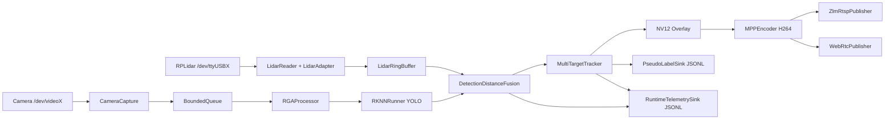
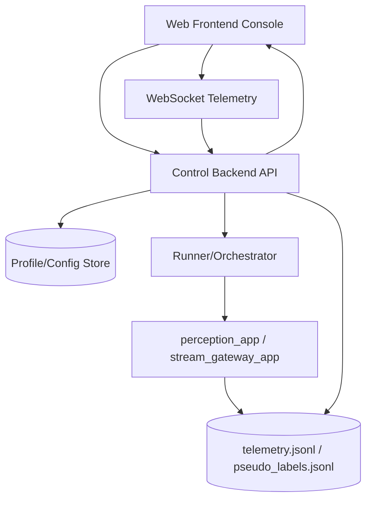

# RK3588 项目架构与接口总览

本文档用于在开发前建立统一认知。

## 1. 设计目标

- 在 RK3588 设备侧实现稳定的实时感知与发布链路。
- 在控制侧提供清晰的配置、任务编排、指标验收能力。
- 保证“数据面”和“控制面”解耦，避免后期功能堆叠导致重构成本飙升。

## 2. 架构范式

采用“数据面 + 控制面”双平面架构：

- 数据面（已实现为主）：C++ 实时 pipeline，负责采集、推理、融合、跟踪、编码、发布。
- 控制面（建议完善）：后端 API + 前端控制台，负责配置下发、任务触发、状态监控、结果回看。

### 2.1 分层说明

1. 设备接入层：CameraCapture、LidarReader。
2. 感知计算层：RGAProcessor、RKNNRunner、DetectionDistanceFusion、MultiTargetTracker。
3. 媒体发布层：MPPEncoder、ZlmRtspPublisher、WebRtcPublisher。
4. 数据输出层：RuntimeTelemetrySink、PseudoLabelSink。
5. 控制编排层（建议）：REST API、WebSocket 推送、场景任务管理、验收判定。

## 3. 当前已实现模块边界

### 3.1 运行入口

- `perception_app`：相机 + LiDAR 融合主链路。
- `stream_gateway_app`：偏视频发布与检测叠加链路。

### 3.2 核心配置对象

- `AppConfig` 统一承载设备参数、模型参数、发布参数、融合参数、跟踪参数、导出参数。

## 4. 接口定义（当前实现）

### 4.1 进程级接口（CLI）

#### perception_app 参数位

| 序号 | 含义 |
|---|---|
| 1 | camera_device |
| 2 | camera_width |
| 3 | camera_height |
| 4 | run_seconds |
| 5 | model_path |
| 6 | model_width |
| 7 | model_height |
| 8 | labels_path |
| 9 | rtsp_url |
| 10 | fps |
| 11 | dump_h264_path |
| 12 | infer_every_n_frames |
| 13 | lidar_port |
| 14 | lidar_baud |
| 15 | lidar_offset_deg |
| 16 | lidar_fov_deg |
| 17 | lidar_window_half_deg |
| 18 | lidar_min_dist_m |
| 19 | lidar_max_dist_m |
| 20 | lidar_max_age_ms |
| 21 | publish_mode (`rtsp`/`webrtc`/`both`) |
| 22 | webrtc_url |

#### stream_gateway_app 参数位

| 序号 | 含义 |
|---|---|
| 1 | model_path |
| 2 | rtsp_url |
| 3 | camera_device |
| 4 | run_seconds |
| 5 | camera_width |
| 6 | camera_height |
| 7 | model_width |
| 8 | model_height |
| 9 | fps |
| 10 | labels_path |
| 11 | publish_mode |
| 12 | webrtc_url |
| 13 | dump_h264_path |
| 14 | infer_every_n_frames |

### 4.2 环境变量接口（重点）

| 变量 | 作用 |
|---|---|
| RK3588_TELEMETRY_PATH | telemetry JSONL 输出路径 |
| RK3588_TELEMETRY_INTERVAL_MS | telemetry 输出周期 |
| RK3588_PSEUDO_LABEL_PATH | 伪标签 JSONL 输出路径 |
| RK3588_PSEUDO_LABEL_MAX_LINES | 伪标签分片滚动阈值 |
| RK3588_PSEUDO_LABEL_SEQUENCE_ID | 采集序列 ID |
| RK3588_DISTANCE_FUSION_MODE | 融合模式：`robust`/`legacy` |
| RK3588_TRACKER_MIN_IOU | 跟踪最小 IoU |
| RK3588_TRACKER_IOU_WEIGHT | 跟踪代价中 IoU 权重 |
| RK3588_TRACKER_GHOST_KEEP_FRAMES | ghost 保留帧数 |
| RK3588_TRACKER_MAX_IDLE_FRAMES | 轨迹最大空闲帧数 |
| RK3588_TRACKER_CENTER_VEL_ALPHA | 中心速度平滑系数 |
| RK3588_TRACKER_GHOST_DECAY | ghost 外推衰减 |
| RK3588_DISABLE_VIDEO_OVERLAY | 关闭视频框绘制 |
| RK3588_DEBUG_VIDEO_HUD | 开启调试 HUD |

### 4.3 数据输出接口

#### 4.3.1 Runtime Telemetry JSONL（每行一个快照）

主字段（节选）：

- pipeline, publish_mode, primary_url
- ts_ms, runtime_sec, frame_id
- capture_to_encode_ms, preprocess_ms, infer_ms, fusion_ms, track_ms
- target_count, confirmed_target_count
- targets[]（含 track_id, track_idle_frames, track_is_ghost, distance_m, ttc_s 等）
- lidar_points[]（角度、距离、x/z 投影）

#### 4.3.2 Pseudo Label JSONL（每行一个 frame）

主字段（节选）：

- schema, sequence_id, source_fps
- frame_id, timestamp_ms, lidar_matched, lidar_delta_ms
- sensor_snapshot（FOV、偏移、窗口、距离阈值、标定 profile）
- objects[]（class/confidence/bbox/track_id/track_age/track_idle/track_is_ghost）

### 4.4 媒体与调试接口

1. RTSP 发布：`rtsp://host:port/app/stream`。
2. WebRTC 播放：`rtc://host:port/app/stream`（由 ZLMediaKit 协商）。
3. Debug UI 服务接口（tools/webrtc_debug_ui/server.py）：
- `GET /api/config`
- `GET /api/telemetry/latest`
- `POST /api/webrtc`（代理到 ZLM `/index/api/webrtc`）

## 5. 数据流向图

### 5.1 设备数据面（实时链路）

### 5.2 控制面与前后端交互（建议落地）

## 6. 推荐后端接口（第一版）

建议按“资源 + 状态机”设计，不直接暴露底层命令细节。

### 6.1 资源模型

- PipelineProfile：一组可复用运行参数。
- RunSession：一次执行实例（启动、运行中、结束、失败）。
- Artifact：输出文件索引（telemetry、pseudo、video、metrics、showcase）。
- GateResult：验收结果（PASS/FAIL + 失败原因）。

### 6.2 REST API（建议）

| 方法 | 路径 | 说明 |
|---|---|---|
| GET | /api/v1/system/status | 设备与服务状态 |
| GET | /api/v1/profiles | 配置列表 |
| POST | /api/v1/profiles | 新建配置 |
| PUT | /api/v1/profiles/{id} | 更新配置 |
| POST | /api/v1/runs | 启动一次 run |
| GET | /api/v1/runs/{runId} | run 状态详情 |
| POST | /api/v1/runs/{runId}/stop | 停止 run |
| GET | /api/v1/runs/{runId}/artifacts | 输出文件索引 |
| POST | /api/v1/runs/{runId}/gate | 执行验收门禁 |
| GET | /api/v1/runs/{runId}/metrics | 汇总指标 |

### 6.3 WebSocket（建议）

- `GET /api/v1/ws/telemetry?runId=...`
- 推送内容：telemetry 增量快照、run 状态变化、告警事件。

## 7. 前后端职责切分建议

### 7.1 后端负责

- 参数校验与默认值合并。
- 运行生命周期管理（start/stop/retry）。
- 统一指标计算与验收判定。
- 历史运行归档与查询。

### 7.2 前端负责

- 配置编辑器（按 profile）。
- 实时监控面板（fps/时延/目标数/告警）。
- 场景测试向导（三场景步骤化）。
- 结果对比页面（不同 run 的指标对比）。

## 8. 推荐开发顺序（防止再次碎片化）

1. 先冻结接口契约：profiles、runs、gate 三类 API。
2. 再实现控制后端：先打通 start/stop + 状态查询。
3. 最后做前端：先监控页，再做配置页和历史页。
4. 每次迭代都以“run 可追溯 + 指标可复现”为验收标准。

## 9. MVP 验收清单

- 有且仅有一份配置输入源（profile）。
- run 全生命周期可查询。
- telemetry 与 pseudo labels 可回放。
- gate 结果可追溯到具体阈值与场景。
- 前端能在 1 个页面完成“启动 -> 观察 -> 停止 -> 看结果”。
